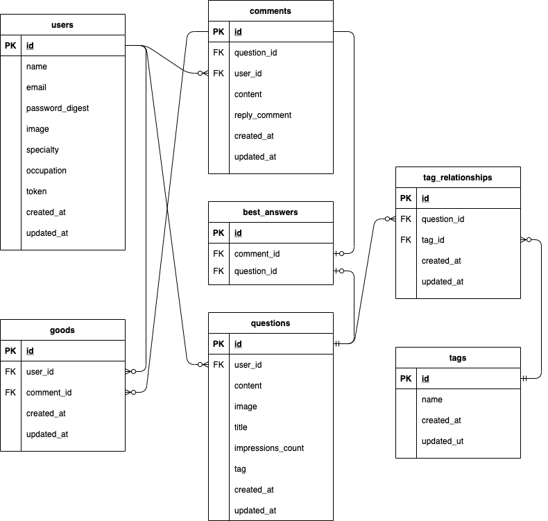

# ENGIDOOR
リンク:https://engidoor.com

## 概要
企業の垣根を超えて技術に関する質問ができるQ＆Aサイトです。
社内に相談できる相手がいない問題に直面した際に、一人で悩むのではなく「誰かに相談できる場を」という思いで作成しました。

## 制作背景
自分が会社で仕事の相談ができる相手がなかなか見つからず困った経験からこのサービスを作ろうと思いました。
現在、自分は化学メーカーに勤めております。しかし、大学時代の専攻は機械工学で仕事内容も機械を扱う機会が多いです。
しかし、化学メーカーなだけあって、周りに機械工学に詳しい人はなかなかおらず、自分一人で悩んでしまうことが多々ありました。
そういった質問のしづらい環境にいる技術者の悩みを解決できればと思っております。

## 使用技術
* フロントエンド  
  * HTML/CSS
  * JavaScript
  * Vue.js（SPA）
  * TailwindCSS（UIフレームワーク）
  * Jest（テスト）
  * ESLint/Prettier（コード解析ツール）
* バックエンド  
  * Ruby 3.0.0
  * Ruby on Rails 6.1.3 （API）
  * Rubocop（コード解析ツール）
  * RSpec（テスト）
* インフラ・開発環境  
  * Docker/Docker-compose
  * AWS（ECR,ECS,VPC,S3,Route53,ALB,RDS,ACM,SSM）
  * CircleCI（CI/CD）
  * Terraform（環境構築）

## インフラ構成図

## ER図

## 機能一覧
* ユーザー機能
  * ユーザー登録機能
  * ログイン機能(ゲストログイン機能含む)
  * プロフィール編集機能
  * ユーザーのジャンル別投稿割合をグラフ化

* 質問機能
  * 質問投稿、削除機能
  * 質問一覧表示機能
  * ユーザーの得意分野に合わせてトップページの表示を変更
  * 質問詳細表示機能
  * コメント機能
  * ページネーション機能
  * いいね機能
  * ランキング機能（質問回答数,いいね数）
  * 画像ファイルアップロード機能
  * 質問検索機能
  * ベストアンサー機能
  * ジャンルでの検索機能
